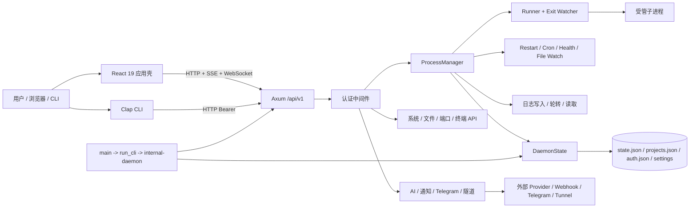

# RunDock / Alter 全项目工程体检报告

> 联合方法：Codemap + Code Overhaul + SonarQube<br>
> 审计日期：2026-08-25（Asia/Shanghai）<br>
> 代码快照：`15aea4916fad15020bb8391262d9f9227f890d59`<br>
> 分支：`codex/rundock-rebrand`<br>
> 审计边界：只审计，不修改生产代码、不删代码、不改依赖、不改数据库/运行配置、不执行整改。

## 0. 结论先行

**项目健康度：46 / 100，阶段判断：可用 V1。**

它不是 Demo：实际守护进程能够管理 13 个进程，`127.0.0.1:2999` 健康接口和由 Alter 管理的 `127.0.0.1:5173` 源码 UI 均返回 HTTP 200；前端 TypeScript 编译、Vitest 22 项测试和生产构建通过。它也还不是“稳定 V1”：权限模型依赖“只监听本机”这一运行时前提，强能力 API 与宽松 CORS/默认免密组合形成高风险面；JSON 状态持久化缺少串行化和事务边界；多条流程会把失败伪装成成功或形成“请求失败但副作用已发生”；核心生命周期、API 和恢复路径缺乏可执行的回归门禁。

最重要的判断是：

1. **现在为什么能跑**：单机单守护进程架构与项目规模匹配；Rust/Axum 把进程管理、状态、日志和 API 集中在一个进程内；React 通过 HTTP/SSE/WebSocket 直接驱动；默认绑定回环地址；关键配置有默认值和兼容逻辑。
2. **哪些是可靠基础**：架构没有不必要的微服务；TypeScript strict 开启；认证使用 Argon2；已有进程代次（generation）防护、健康接口、状态恢复、项目兼容迁移、前端单测框架和构建链。
3. **哪些只是暂时没出问题**：本机绑定、低并发和人工操作顺序掩盖了认证边界、并发保存、部分成功、PID 复用、重复生命周期实现、无限日志读取和错误静默等问题。
4. **整改原则**：先封权限和数据一致性，再修恢复/生命周期，再补门禁和测试，最后才拆大文件、清重复与 dead code。不要全面重构。

## 1. 审计范围、证据与限制

### 1.1 已完成的证据

- Codemap：208 个一方文件、50,646 行（包含文档与交付资产），划分 12 个功能模块；每个模块独立审计并生成可交互 HTML/Markdown 图谱。
- Code Overhaul：覆盖架构、业务状态、数据持久化、安全、测试、发布、依赖、可观测性、性能与 dead/legacy code。
- SonarQube：本地 SonarQube 26.8，项目键 `rundock-alter-v1-audit`，扫描 190 个文件，识别 Rust、TypeScript、CSS、JSON、YAML；分析成功上传。
- 运行态：监听 PID、完整命令行、父进程链、健康接口和 UI HTTP 响应均已实测。
- 构建验证：前端 format/lint/typecheck/test/build、Rust fmt/check/test/clippy、依赖树、npm audit/outdated 均实际执行。

审计收口时的运行快照：

| 路由 | 监听证据 | 响应 |
|---|---|---|
| Daemon `127.0.0.1:2999` | PID 31156，`C:\Program Files\alter\alter.exe --internal-daemon --host 127.0.0.1 --port 2999` | `/api/v1/system/health`：HTTP 200，`status=ok`，13 个进程，版本 1.1.0 |
| Source UI `127.0.0.1:5173` | PID 26064，当前仓库 `web-ui/node_modules/.../vite.js --host 127.0.0.1 --port 5173`；父进程链归属 Alter 管理 | `/`：HTTP 200，800 bytes |

### 1.2 重要限制

- 当前 Rust 是 `x86_64-pc-windows-gnu` 工具链；环境缺少 `gcc.exe` / `dlltool.exe`，所以 `cargo check/test/clippy` 没有越过 `ring` 构建阶段。不能把这些失败解释为 Rust 业务代码失败，也不能声称 Rust 已通过验证。
- Sonar 的 Rust Clippy 传感器因同一 `gcc.exe` 缺失而失败；Rust 仍完成语法级分析，但缺少 Clippy 证据。
- Sonar Coverage 为 0%，原因是本轮没有可导入的 LCOV：前端缺少 `@vitest/coverage-v8`，Rust 缺少可工作的覆盖率工具链。SonarQube 本身不生成覆盖率，而是导入外部测试工具的报告（[官方 Coverage 参数文档](https://docs.sonarsource.com/sonarqube-server/analyzing-source-code/test-coverage/test-coverage-parameters)）；该数字表示“未导入覆盖率”，不是“已证明所有代码都未测试”。
- 未进行真实外网 AI 调用、Telegram/通知发送、隧道创建、自更新、进程杀死、安装/卸载、发布或生产数据破坏性测试。
- 当前源码常见密钥模式扫描未发现命中；`gitleaks` 不可用，未完成全 Git 历史秘密扫描，因此结论是“当前扫描未见”，不是“历史绝对干净”。
- 运行中的安装版报告版本 `1.1.0`，但不能仅据端口证明它与当前 checkout 二进制逐字节相同。

## 2. 项目架构图：系统到底怎么跑



### 2.1 核心业务流

```text
用户操作
  -> React api.ts / CLI DaemonClient
  -> Axum 认证中间件
  -> 路由解析与输入转换
  -> ProcessManager 改变内存态 / 启停 OS 子进程
  -> 后台写 state.json、projects.json 和日志
  -> SSE / WebSocket / 轮询把结果送回前端
```

### 2.2 状态流与失败点

```text
AppConfig -> ProcessInstance -> OS PID -> ProcessInfo -> UI
     |             |              |          |
     +------ snapshot() -----------+          +-- 可能包含 env
                    |
                    +-> SavedState -> 固定 state.json.tmp -> rename / 直接覆盖

失败风险：副作用先发生、持久化后失败；多个 detached save 乱序；
固定 tmp 文件并发碰撞；直接覆盖中断会损坏主文件；恢复只看 PID 存活而不校验身份。
```

### 2.3 架构判断

当前“单个 Rust 守护进程 + 嵌入/独立 React UI + JSON 文件持久化”适合本地 V1，没有必要引入微服务、Kafka、Kubernetes、CQRS 或 Event Sourcing。问题不是架构层级不够高级，而是单体内部边界欠设计：路由同时承担校验、业务编排、OS 副作用和持久化；`ProcessManager` 内有多套生命周期；前端根壳和页面承担过多协调职责。

## 3. Codemap 模块体检

Codemap 严格评分平均 **45.8 / 100**，分布为 8 个 D、4 个 F；共记录 26 个 HIGH、97 个 MED、29 个 LOW 证据项。

| 模块 | 职责 | 耦合 | LOC | 分数 |
|---|---|---:|---:|---:|
| 认证与本机系统能力 API | 认证、系统文件、脚本、端口、终端、自更新 | core | 2,642 | 30 / F |
| AI、通知、隧道与观测集成 | 外部 Provider、Webhook、Telegram、Tunnel、Metrics | high | 4,036 | 35 / F |
| CLI、守护进程与 Web 入口 | 启动、守护、路由装配、静态资源 | core | 1,587 | 38 / F |
| 构建、发布与工程文档 | CI、安装器、脚本、文档 | med | 16,576 | 38 / F |
| 前端进程与项目工作台 | 进程/项目主操作页面 | high | 6,120 | 48 / D |
| 进程监督与日志核心 | spawn、restart、cron、watch、health、logs | core | 3,012 | 48 / D |
| 进程、项目与 Ecosystem API | CRUD、批量操作、生态配置 | core | 1,329 | 49 / D |
| 配置、模型与 JSON 持久化 | 状态、项目、认证、AI、通知配置 | core | 2,065 | 50 / D |
| React 应用壳与导航 | 路由、全局状态、导航、认证门禁 | core | 3,518 | 52 / D |
| 前端 API、认证与轮询层 | transport、token、SSE、hooks | core | 1,916 | 52 / D |
| 前端观测与运维页面 | Analytics、Logs、Ports、Cron、Tunnels | med | 3,588 | 54 / D |
| 前端设置、AI 与终端 | Settings、AI Panel、Terminal | high | 4,257 | 55 / D |

高置信度交叉主题：

- 安全性依赖运行环境约束，而不是由代码强制。
- 多处将真实失败伪装为成功、空数据、零值或首次启动。
- JSON 持久化和 OS 副作用缺乏统一事务/补偿边界。
- 生命周期、前端操作和配置 UI 有重复实现，行为已开始漂移。
- 测试与 CI 没覆盖最高风险的权限、并发、恢复和部分成功边界。
- 总体架构规模合理，但模块内部职责边界薄弱。

## 4. 项目健康度

| 维度 | 分数 | 依据 |
|---|---:|---|
| 架构合理性 | 6 / 10 | 本地单体符合规模、依赖方向大体清楚；API/Manager/UI 根组件职责过载，副作用和持久化跨层。 |
| 业务逻辑 | 5 / 10 | 核心启停流程完整；存在部分成功、状态跳跃、批量吞错、恢复和重复执行风险。 |
| 代码质量 | 4 / 10 | Sonar 551 smells；`App.tsx`、`manager.rs`、`ai.rs` 为复杂度热点；前端 lint 46 errors。 |
| 数据设计 | 4 / 10 | 小型本地项目使用 JSON 合理；无版本化 schema/迁移账本，写入不串行、回滚和损坏恢复不足。 |
| 稳定性 | 5 / 10 | 当前运行态健康；watcher 生命周期、日志 writer、PID 身份、关停保存、错误降级存在核心缺口。 |
| 测试 | 4 / 10 | 前端 22 项通过，Rust 源内有测试；无 API/E2E/恢复/并发门禁，Rust 本轮被环境阻塞，coverage 未接入。 |
| 安全性 | 3 / 10 | 回环绑定降低暴露；但默认免密 + Any CORS + 高权限 API、路径穿越、SSRF/密钥外发、自更新链严重。 |
| 性能与资源 | 5 / 10 | V1 规模下尚可；整文件日志读取、无界 lines、重叠轮询、日志任务泄漏、大前端 bundle 有明确证据。 |
| 可观测性 | 5 / 10 | 有 tracing、health、metrics、日志与 UI；多处 catch/unwrap 默认值隐藏错误，告警可能风暴。 |
| 文档与可维护性 | 5 / 10 | 文档和发布资产丰富；版本、能力、包管理锁文件和 CI 门禁漂移。 |
| **总分** | **46 / 100** | **可用 V1；不满足稳定 V1。** |

## 5. SonarQube 客观指标

### 5.1 扫描结果

分析时间为 2026-08-25 17:03:32 +08:00，Analysis ID 为 `4ae5e3f1-16e2-48a7-ad31-710b82bcd04d`；本机 Dashboard：`http://127.0.0.1:9000/dashboard?id=rundock-alter-v1-audit`。

| 指标 | 结果 |
|---|---:|
| 扫描代码 | 29,690 NCLOC，167 个度量文件 |
| Bugs | 33 |
| Vulnerabilities | 1 |
| Security Hotspots | 0 |
| Code Smells | 551 |
| 未解决问题 | 585（Critical 44 / Major 329 / Minor 212） |
| Duplication | 3.2%，60 blocks，1,091 lines |
| Coverage | 0.0%（3,523 / 3,523 待覆盖行；未导入 coverage） |
| Cognitive Complexity | 3,681 |
| Cyclomatic Complexity | 6,166 |
| Maintainability Rating | A |
| Reliability Rating | D |
| Security Rating | B |
| Technical Debt | 2,632 分钟（43 小时 52 分） |
| Technical Debt Ratio | 0.3% |

Sonar Quality Gate 显示 `OK`，但 **conditions 为空**。这只说明扫描完成，不能说明达到发布标准。扫描还出现 Rust Clippy 传感器因 `gcc.exe` 缺失而失败，必须与语法分析结果分开理解。

### 5.2 值得优先处理的 Sonar 结果

- `typescript:S2871` 2 个 Critical：数组字母排序未提供基于 `localeCompare` 的比较函数，例如 `web-ui/src/App.tsx:719`；结果可能因字符集/大小写表现不稳定，属于真实功能缺陷。
- `rust:S3776` 28 个、`typescript:S3776` 13 个：与人工审计的 `ProcessManager`、`App.tsx`、`ai.rs`、`ProcessesPage` 热点一致，属于高置信度维护风险。
- 可访问性规则：`S1082` 31 个 bug、`S6848` 27 个 smell，说明鼠标可用但键盘不可用的交互较普遍，若面向更多用户值得系统修复。
- 重复热点：`EnvFilePanel.tsx` 45.6%、`EnvFileModal.tsx` 42.6%、`NotifModal.tsx` 24.5%、`telegram/commands.rs` 23.0%、`notifications/sender.rs` 13.0%、`ai.rs` 10.9%、`ProcessesPage.tsx` 10.6%。只应抽取稳定业务规则，不应为了降数字制造抽象。

### 5.3 低价值或需人工复核的规则

- 158 个 `button` 缺少显式 `type`、102 个 React props 未标 readonly、73 个嵌套三元表达式：可作为日常清理，但不应抢占 P0/P1。
- 唯一 vulnerability 是 `GitHubStarBanner.tsx:33` 的 `window.open`；代码已经使用 `noreferrer`，应人工确认浏览器语义后再定性，当前不应把它当作项目最大的安全问题。
- `.at()`、`replaceAll()`、PascalCase 等规则多数是现代化/风格建议，按触达频率顺手处理即可。
- Sonar 未识别默认免密 + Any CORS + 高权限本机 API、env 路径穿越、任意 Provider URL 携带密钥、并发状态覆盖等真正高风险组合，证明静态评分不能替代威胁建模和业务审计。

## 6. 问题优先级总览

### P0：先处理，否则无法可靠扩大使用范围

| ID | 问题 | 位置 | 来源 |
|---|---|---|---|
| P0-1 | 默认免密 + Any CORS + 高权限 API 形成跨来源本机控制面 | `src/api/middleware.rs:25-39`、`src/daemon/server.rs:14-24`、`src/api/routes/system.rs:193-300`、`terminal.rs:123-143` | Codemap + Overhaul |
| P0-2 | env 文件名允许路径穿越，可越界读取/覆盖文件 | `src/api/routes/processes.rs:47-50,490-532` | Codemap + Overhaul |
| P0-3 | 状态保存并发覆盖、固定 tmp、失败后直接覆盖主文件 | `src/daemon/state.rs:113-145`、`src/api/routes/processes.rs:121-204` | Codemap + Overhaul |
| P0-4 | 自更新下载源校验不足，最终执行安装器/替换二进制 | `src/api/routes/update.rs:138-243` | Codemap + Overhaul |

### P1：核心稳定性与边界

| ID | 问题 | 位置 | 来源 |
|---|---|---|---|
| P1-1 | 进程已启动后项目保存失败，无回滚；项目更新也可半成功 | `processes.rs:110-122`、`projects.rs:323-357` | Codemap + Overhaul |
| P1-2 | watcher 结果立即丢弃，文件监听可能立刻失效 | `src/process/manager.rs:829`、`src/process/watcher.rs:11-62` | Codemap + Overhaul |
| P1-3 | restart_loop 重复 spawn 逻辑且漏掉初始启动钩子/健康/监听 | `src/process/manager.rs:671-988` | Codemap + Sonar + Overhaul |
| P1-4 | LogWriter 重建时旧任务未显式终止，可能重复写和泄漏句柄 | `manager.rs:660,897,1102`、`logging/writer.rs:57-75` | Codemap + Overhaul |
| P1-5 | PID 只判“存在”不判身份，恢复/停止可能操作复用后的无关 PID | `src/daemon/state.rs:231-252`、`manager.rs:1471-1538`、`utils/pid.rs:5-44` | Codemap + Overhaul |
| P1-6 | AI/通知/隧道允许自定义目的地并携带秘密或本地数据，存在 SSRF/外发面 | `src/api/routes/ai.rs:460-574,809-832`、`notifications.rs:78-145` | Codemap + Overhaul |
| P1-7 | Telegram 空白名单即允许全部 chat 执行进程控制命令 | `src/telegram/bot.rs:147-173` | Codemap + Overhaul |
| P1-8 | 发布工作流权限过宽，APT 可在未签名时继续发布 | `.github/workflows/release-linux.yml:12-15,271-301` | Codemap + Overhaul |

### P2：应该逐轮降低的工程债

- `App.tsx` 2,415 NCLOC / cognitive 202，`manager.rs` 1,352 NCLOC / cognitive 375，`ai.rs` cognitive 187；模块内职责过多。
- API、SSE、设置和 Analytics 多处把错误转换为空值/零值/成功 toast，故障不可见。
- 日志读取先把整个文件读入内存，API `lines` 无上限；前端日志流持续 append。
- 前端轮询无 abort/防重入；慢请求可重叠，页面切换后的响应可回写旧状态。
- CI 仅在版本 tag 构建，缺少 PR/main 的 test、lint、clippy、audit、Sonar 门禁。
- npm 有 13 个已报告漏洞（11 high、2 low）和 38 个 outdated 项；必须逐项看可达性和升级破坏面，禁止一键大升级。
- Cargo 依赖树存在 28 个重复 crate 名（59 个重复条目）；`thiserror`、`tokio-util`、`rand` 在一方 Rust 源码中未见引用，需先用编译/依赖工具确认再删。
- npm 与 bun 双锁文件内容漂移，CI 实际固定 `npm ci`。
- 前端单 bundle 908,967 bytes（gzip 245,644），Vite 给出 >500 kB 警告；路由级拆包有明确收益。
- health 超过阈值后每轮重复报警；通知风暴缺少抑制、恢复事件和退避。

### P3：低风险、低 ROI 或代码洁癖

- `button type`、readonly props、`.at()`、`replaceAll()` 等批量规则。
- 文档排版、命名和目录美化。
- 仅为减少 3.2% 全局 duplication 而抽象短 CLI 命令。
- 在没有真实性能证据前引入缓存层、消息队列或服务拆分。

## 7. 重点问题详解

### 7.1 P0-1：本机高权限控制面没有代码级安全护栏

- **模块/来源**：认证与本机系统能力 API；Codemap + Code Overhaul。
- **原因**：默认 `host=127.0.0.1`，但 host 可配置；CORS 允许任意 origin/method/header；未设置 Web 密码时认证中间件直接放行。后端同时提供任意目录环境同步、文件读写、Shell、脚本执行、PID kill 和更新能力。
- **实际影响**：在默认免密状态，恶意网页或本机低权限程序有机会调用高权限本机 API；若绑定非回环地址，风险扩大为局域网/网络远程控制面。
- **概率**：默认本机单人使用时中；一旦非回环或访问恶意页面时高。
- **收益/成本/风险**：收益极高；成本中；修改风险中高，因需保留首次安装和 CLI 兼容。
- **Blast Radius**：所有 API、CLI、UI、自动化、远程服务器模式。
- **建议**：代码强制“非回环必须启用认证”；免密模式只允许受信 origin 或禁用跨来源 CORS；把文件/终端/更新/kill 划为高权限能力并单独授权；为兼容路径增加明确迁移和回滚开关。

### 7.2 P0-2：env 文件路径穿越

- **模块/来源**：进程/项目 API；Codemap + Code Overhaul。
- **原因**：验证只检查 `.env` 前后缀，不拒绝 `/`、`\\`、`..`、绝对路径或规范化后越过 cwd；随后直接 `cwd.join(filename)`。
- **实际影响**：可读取或覆盖进程工作目录外的文件；与免密控制面组合后升级为严重安全问题。
- **概率**：被主动利用时高；日常误触低。
- **收益/成本/风险**：收益极高；成本低；修改风险低。
- **Blast Radius**：env 编辑 UI、对应 GET/PUT API、所有受管项目目录。
- **建议**：只接受单个文件名组件；拒绝分隔符/父目录/绝对路径；canonicalize 父目录并验证仍在 cwd；增加 Windows 与 Unix 路径用例。

### 7.3 P0-3：状态持久化没有单写者与可恢复提交协议

- **模块/来源**：状态持久化、进程 API；Codemap + Code Overhaul。
- **原因**：多个路由 detached `save_to_disk`；每次都写固定 `state.json.tmp`；rename 失败后删除 tmp 并直接覆盖主文件；没有 Mutex/队列、代次号、fsync、备份、checksum 或写后校验。
- **实际影响**：并发请求、快速退出、杀进程或磁盘异常可造成旧快照覆盖新快照、丢操作、半文件或无法恢复。
- **概率**：正常低并发时中低；批量操作/快速重启/磁盘异常时中高。
- **收益/成本/风险**：收益极高；成本中；修改风险中，需要兼容已有 JSON。
- **Blast Radius**：全部进程恢复、项目关联、重启后状态。
- **建议**：建立单写者保存队列；请求可选择等待确认；每次唯一 tmp + replace；保留 last-known-good；写入版本/序列和校验；故障注入测试覆盖并发/断电/磁盘满。

### 7.4 P0-4：自更新信任边界不足

- **模块/来源**：系统能力 API；Codemap + Code Overhaul。
- **原因**：下载地址只做宽泛 GitHub HTTPS 前缀检查，没有固定 owner/repo、发布资产白名单、哈希/签名、大小上限；下载后执行安装器或替换二进制。
- **实际影响**：被篡改或错误配置的更新元数据可变为代码执行；与 P0-1 组合时危害放大。
- **概率**：日常低，供应链/主动攻击场景中高。
- **收益/成本/风险**：收益极高；成本中；修改风险中。
- **Blast Radius**：守护进程二进制、安装目录、后续全部受管进程。
- **建议**：固定可信 release 仓库与资产模式，校验 SHA-256/签名，限制大小和重定向，下载后原子替换，失败恢复旧版本。

### 7.5 P1-1：副作用与持久化形成“失败但已执行”

- **模块/来源**：进程/项目 API；Codemap + Code Overhaul。
- **原因**：先启动进程再保存项目；保存失败直接返回错误但不停止进程。项目更新先写 store，再逐个改成员，任何一步失败都不补偿。
- **实际影响**：用户重试会重复执行；UI、内存进程态与 projects.json 分裂。
- **概率**：磁盘/权限/成员失败时高。
- **收益/成本/风险**：收益高；成本中；修改风险中。
- **Blast Radius**：启动、项目编辑、批量启用、恢复。
- **建议**：为每条命令明确 prepare/commit/compensate；返回结构化 partial result；幂等键/版本检查；测试每一步故障。

### 7.6 P1-2/P1-3/P1-4：三套生命周期行为漂移

- **模块/来源**：进程监督与日志核心；三方共同发现。
- **原因**：初次 spawn、restart loop、手动 restart 复制大量流程；watcher 返回值丢弃；重建 LogWriter 时旧后台任务未显式 abort；重启分支没有完全复用 hooks/health/watch 装配。
- **实际影响**：同一进程首次启动正常、重启后能力消失；文件监听不工作；重复日志、句柄/任务泄漏。
- **概率**：启用 watch、频繁重启或长时间运行时中高。
- **收益/成本/风险**：收益高；成本高；修改风险高。
- **Blast Radius**：所有进程生命周期、日志、健康检查、cron、hooks。
- **建议**：先写行为特征测试，再把“构建运行时附件”收敛成唯一函数；资源采用有所有权的 handle，并在替换/停止时显式 cancel + await。

### 7.7 P1-5：PID 复用与恢复身份不明

- **模块/来源**：守护启动、状态恢复、进程监督；Codemap + Overhaul。
- **原因**：PID 文件是建议性信息；恢复和停止主要检查 PID 存活，部分辅助函数还用命令行 substring；没有启动时间、可执行文件、命令哈希或 OS job identity。
- **实际影响**：重启后可能把无关进程当作受管进程，甚至停止错误目标；cron 失败后仍调度可能形成重复执行。
- **概率**：普通运行低，崩溃后长间隔恢复/PID 复用时中。
- **收益/成本/风险**：收益高；成本中高；修改风险中。
- **Blast Radius**：恢复、stop/delete、cron、daemon restart。
- **建议**：保存并验证 identity tuple；不匹配时进入 `orphaned/needs_adoption` 明确状态，不直接 kill；恢复流程可重复执行且有锁。

### 7.8 P1-6/P1-7：外部集成的出站边界不清

- **模块/来源**：AI、通知、Telegram、隧道；Codemap + Overhaul。
- **原因**：自定义 base URL/webhook 直接接受并发送密钥；AI 诊断会携带命令、cwd、日志；Telegram 空白名单 fail-open；配置接口回传完整敏感 URL/token。
- **实际影响**：SSRF、内部服务探测、密钥/日志外发、未授权远程进程控制。
- **概率**：仅可信单人配置时中低；导入配置/误填/泄漏 bot token 后高。
- **收益/成本/风险**：收益高；成本中；修改风险中。
- **Blast Radius**：AI、Webhook、Telegram、Tunnel、前端设置和日志诊断。
- **建议**：出站目标策略、私网/metadata 地址阻断、密钥单向写入和掩码读取、发送前脱敏/大小限制/用户确认、Telegram whitelist fail-closed。

### 7.9 P1-8：发布链可在权限过宽和未签名下继续

- **模块/来源**：交付与文档；Codemap + Overhaul。
- **原因**：workflow 全局授予 contents/pages/id-token write；第三方 action 仅按 tag 未 pin SHA；缺少 GPG key 时明确继续发布 unsigned APT。
- **实际影响**：依赖/Action 供应链受污染时可触达发布权限；用户无法验证包真实性。
- **概率**：低，但影响高。
- **收益/成本/风险**：收益高；成本中；修改风险低到中。
- **Blast Radius**：GitHub Release、APT、全部下载安装用户。
- **建议**：job 级最小权限；action pin SHA；签名缺失 fail-closed；构建与发布 job 分离并传递已校验 artifact。

### 7.10 P2：错误被伪装为成功或空数据

- **模块/来源**：前端壳、运维页、API；Codemap + Overhaul。
- **证据**：`App.tsx:208-218` 保存失败仍 success toast；`ProcessDetailPage.tsx:46-50` 首次加载失败停在 loading；Analytics/LogVolume/LogLibrary 将 API 错误转为 0/空；`processes.rs:248-272` 日志 I/O 错误转空。
- **影响/概率**：故障时高概率误导用户，重复操作或错过真实数据损坏；不会总是直接破坏数据。
- **收益/成本/风险**：收益高；成本中；风险低。
- **Blast Radius**：几乎所有 UI 运维判断和客服诊断。
- **建议**：区分 `loading / empty / stale / failed / partial`，保存成功只在后端确认后显示；保留 last-known-good 并标注时间。

### 7.11 P2：日志与轮询存在可证明的资源放大

- **模块/来源**：日志、前端 transport；Codemap + Overhaul。
- **原因**：日志读取先载入全文件；`lines` 可为任意 `usize`；页面持续追加；多个 hooks 定时器不防请求重叠/不 abort。
- **影响/概率**：大日志、慢磁盘或慢网络时内存/CPU/请求量增长；日常小规模中低，大型日志时高。
- **收益/成本/风险**：收益中高；成本中；风险低中。
- **Blast Radius**：日志页、ProcessDetail、Analytics、daemon I/O。
- **建议**：后端 seek/tail 与硬上限；前端 ring buffer/虚拟列表；轮询 single-flight、AbortController、退避和页面可见性暂停。

### 7.12 P2：验证门禁不足且本地工具链不可复现

- **模块/来源**：交付、测试；Code Overhaul + 实际命令。
- **原因**：CI 只在版本 tag 构建；本机 GNU Rust 工具链缺系统工具；前端格式/lint 已大量失败；coverage provider 未声明。
- **影响/概率**：提交和 PR 阶段无法阻断回归，发布时才发现问题；新环境难复现。
- **收益/成本/风险**：收益高；成本中；风险低。
- **Blast Radius**：全部模块、所有贡献者和发行版。
- **建议**：先明确 MSVC 或补齐 GNU 工具链并锁定；PR 门禁按 fmt -> lint -> typecheck -> unit -> build；再引入风险场景测试和 coverage 导入。

## 8. 技术债 Top 10

按“风险 × 影响 × 未来维护成本 × 修改收益”排序：

| 排名 | 技术债 | 为什么现在排前面 |
|---:|---|---|
| 1 | 默认免密/Any CORS 与高权限 API 组合 | 影响面最大，且安全性依赖部署习惯而非代码不变量。 |
| 2 | env 路径穿越 | 低成本即可封堵直接文件读写越界，ROI 最高。 |
| 3 | 状态保存无单写者/恢复提交协议 | 触达全部进程，可能造成重启后的不可逆状态丢失。 |
| 4 | 自更新供应链校验不足 | 低频但可执行任意代码，必须先于功能扩张。 |
| 5 | 生命周期重复实现与资源所有权缺失 | watch、health、hooks、logs 在重启后行为不一致，长期运行风险高。 |
| 6 | OS 副作用与 JSON 提交不可原子、无补偿 | 形成“报错但已执行”，用户重试会放大后果。 |
| 7 | PID 身份与恢复幂等性不足 | 崩溃恢复可能接管/停止错误进程或重复 cron。 |
| 8 | AI/通知/Telegram 出站与秘密边界 | 功能越丰富，SSRF、密钥和日志外发面越大。 |
| 9 | 核心风险缺少 API/恢复/并发测试和 CI 门禁 | 没有护栏时修复 1-8 本身也容易制造回归。 |
| 10 | 大文件、错误静默与重复 UI/生命周期代码 | 使每次改动影响面难预测；应在高风险行为受测试保护后逐步拆。 |

## 9. 数据与“数据库”专项

本项目当前没有关系型数据库；持久化是 JSON/配置文件。因此 Schema、Migration、PK、FK、Unique Constraint、Index、SQL Injection、N+1 Query 均 **不适用**，不能为了满足检查表而引入数据库。

| 主题 | 当前状态 | 风险 |
|---|---|---|
| Schema | Serde 结构即隐式 schema | 字段默认值可掩盖旧/坏数据，缺显式版本。 |
| Migration | 有局部兼容读取/字段默认，无统一 ledger | 无法知道文件已迁移到哪个版本，也难回滚。 |
| 主键/关系 | 进程 UUID、项目成员名称/ID 混合 | rename、clone、删除后可能留下关系漂移。 |
| 时间字段 | `saved_at` 等零散存在 | 未作为并发版本或恢复判定依据。 |
| 一致性 | 内存、OS 进程、state、projects 分步更新 | 半成功、旧快照覆盖、请求重试重复执行。 |
| 删除策略 | 多个 API 执行 OS 操作后再保存 | 保存失败时删除/停止语义与持久态分裂。 |
| 回滚 | 基本依赖下次保存/人工操作 | 无 last-known-good 或事务补偿协议。 |

建议仍保留文件型存储，但补上 `schema_version`、单写者、唯一 tmp、原子 replace、备份、checksum/写后读、乐观版本和幂等命令。只有当多用户、多机或查询需求真实出现时，再评估 SQLite。

## 10. 稳定性场景矩阵

| 场景 | 当前行为/证据 | 可恢复性判断 |
|---|---|---|
| API 超时/网络断开 | 前端多处转空/零或无 abort；用户可能重试 | 不明确，可能重复副作用 |
| 第三方 500/429 | 通知/AI 错误处理散落，缺统一退避/幂等 | 部分可恢复，重复计费/发送边界不清 |
| AI 空内容 | 部分检查存在，但各 Provider/端点语义分散 | 需要逐端点契约测试 |
| AI 错误 JSON/Markdown | 有解析/fallback，但容易把格式问题转普通文本 | 可降级，结果语义不总明确 |
| 字段缺失/null | Serde/TS 默认值较多；PATCH 会重建并清空未提交字段 | 有数据覆盖风险 |
| 上传失败 | 本项目不是上传驱动；脚本/更新下载更关键 | 更新下载缺完整性提交协议 |
| 文件损坏/磁盘满 | 多配置 load 失败回默认；state 直接覆盖 fallback | 容易“像首次启动”，恢复弱 |
| Worker/子进程异常退出 | 有 exit watcher/autorestart/health | 基础存在，但重启路径行为漂移 |
| Task 中途失败 | 无统一任务状态机；路由副作用分步执行 | 常见 partial state |
| 重复执行/重复请求 | clone 名称非原子、系统恢复无锁、命令缺幂等键 | 有重复进程/重复状态风险 |
| 程序重启 | state restore 存在 | PID 身份、cron、dead 字段和损坏恢复不足 |
| 并发请求 | detached save + 固定 tmp；设置保存可乱序 | 高风险边界 |

## 11. 测试、Build、Lint、Typecheck 实测

### 11.1 命令结果

| 命令 | 结果 | 说明 |
|---|---|---|
| `cargo fmt --all -- --check` | 失败 | 54 个 Rust 路径、345 个 diff hunk 不符合 rustfmt；未自动格式化。 |
| `cargo check --all-targets --locked` | 环境阻塞 | `ring v0.17.14`：`ToolNotFound: failed to find tool "gcc.exe"`。 |
| `cargo test --all-targets --locked` | 环境阻塞 | 缺少 `dlltool.exe`，未进入完整 Rust 测试执行。 |
| `cargo clippy --all-targets --all-features --locked -- -D warnings` | 环境阻塞 | 同样缺少 `gcc.exe`。 |
| `cargo tree --duplicates` | 通过 | 28 个唯一 crate 名存在多版本，59 个重复条目。 |
| `npm run format:check` | 失败 | 69 个文件有 Prettier 格式问题；未自动格式化。 |
| `npm run lint` | 失败 | 58 项：46 errors、12 warnings。 |
| `npx tsc -b --pretty false` | 通过 | TypeScript 构建无错误。 |
| `npm test` | 通过 | 6 个测试文件、22 项测试全部通过。 |
| `npm run test:coverage` | 未执行 | `@vitest/coverage-v8` 未安装，避免改依赖。 |
| `npm run build` | 通过 | 1,858 modules；产物 935,277 bytes，Vite 提示 chunk > 500 kB。 |
| `npm audit --json` | 报告风险 | 13 项：11 high、2 low；需逐项可达性分析。 |
| `npm outdated --json` | 报告漂移 | 38 个依赖有新版本；不等于应立即升级。 |

### 11.2 现有测试层级

| 层级 | 当前情况 | 关键缺口 |
|---|---|---|
| Unit | Rust 源内有配置/格式/日志/隧道等单测；前端 22 项通过 | Rust 本轮未跑通；关键安全和事务边界不足 |
| Integration | 少量组件 + API mock | 缺真实 daemon + 临时目录 + 子进程组合测试 |
| API | 未发现系统性路由契约套件 | auth/CORS/path/PATCH/partial result/幂等均缺 |
| E2E | 未发现浏览器 E2E | 启动->日志->重启->恢复->项目关联完全靠人工 |
| Smoke | 健康接口和 UI HTTP 200 已人工验证 | 未进入 CI，未验证新构建二进制 |

目前完全或主要依赖人工点击的核心流程：首次启用认证、远程服务器连接、创建/编辑/克隆进程、项目成员批量启停、watch restart、cron、日志流、terminal、AI 诊断、通知/Telegram、隧道、自更新、daemon restart 后恢复。

## 12. 安全专项

### 12.1 按部署形态判断

- **个人本地项目**：保持严格 loopback 且设备可信时可用，但恶意网页/本机进程、默认免密和秘密外发仍需 P0/P1 处理。
- **内部网络项目**：当前不合格；非回环必须强认证、TLS/反向代理、最小权限、审计和出站策略。
- **对外 SaaS**：当前架构与权限模型不适用；缺用户/租户隔离、授权模型、CSRF/限流/审计等。不要在现状上直接暴露公网。

### 12.2 其他证据

- session token 存在 `localStorage`，SSE 通过 query token；可能进入浏览历史、代理/访问日志或 XSS 读取面。
- ProcessInfo/API 配置可带完整 env；通知、AI、Tunnel 设置读取可能回传完整秘密。
- 登录无明确 rate limit；session 清理主要在请求路径。
- auth 配置读取损坏时会回到新 passwordless 配置，并忽略保存错误，属于 fail-open 倾向。
- Metrics 文本拼接标签，未见统一转义；需防止非法 label/换行破坏格式。
- 本地 SonarQube 仅监听 `127.0.0.1`，降低网络暴露；但默认管理员凭据仍有效，属于共享审计工具自身的配置风险。本轮未更改。

## 13. 性能与资源专项

有明确证据的改进点：

- `logging/reader.rs` 整文件读入内存，API lines 无上限；应改 seek/tail + 最大行数/字节数。
- ProcessDetail 的实时日志持续 append；需要 ring buffer、批量刷新或虚拟列表。
- `useProcesses/useProjects/useHealth` 等定时轮询没有 single-flight/abort；慢请求会重叠。
- LogWriter/background task 资源所有权不清，重启可能泄漏任务和文件句柄。
- 前端最大 JS 908,967 bytes；适合按路由懒加载，而不是先引入复杂缓存。
- health 超阈值每轮通知，可能产生告警风暴和外部请求放大。
- AI 诊断直接发送大量命令/cwd/logs，没有统一大小/脱敏预算；可能增加 token 成本并泄密。

没有数据库，因此 N+1、索引和重复 SQL 不适用。没有证据支持引入 Redis、消息队列或分布式缓存。

## 14. Dead Code / Legacy Code 与删除候选

### 14.1 可以安全删除（仍应单独提交并跑回归）

- `web-ui/src/App.css`：Vite 模板残留；入口只导入 `index.css`，当前代码引用扫描未发现导入。
- `web-ui/src/test/example.test.ts`：文件自身标注“delete and replace”，只验证 `1 + 1 = 2`；删除不影响真实覆盖。

### 14.2 需要确认后删除

- `src/process/rolling_restart.rs`：公开模块但实现只返回未支持；确认 CLI/API/文档兼容后删除或明确 feature gate。
- `src/notifications/dispatcher.rs`、`events.rs`、`channels/*`：`notifications/mod.rs` 当前只导出 `sender`，疑似未接入旧架构；先做全 feature/历史兼容确认。
- `Cargo.toml` 的 `thiserror`、`tokio-util`、`rand`：一方源码引用扫描未命中；Rust 工具链恢复后用依赖工具和全目标构建确认再删。
- `web-ui/bun.lock`：与 npm/package-lock/CI 路径漂移；先明确唯一包管理器。
- auth passkey 501 stub、`autorestart_on_restore` 保存但不消费的字段：先决定公开 API/数据兼容策略。

### 14.3 暂时不要删除

- `alter` CLI 名、`alter.exe`、旧数据目录和兼容字段：它们承担现有用户/脚本和历史状态兼容。
- 项目名称/进程标识迁移逻辑：看似绕路，但直接删除可能破坏现有 `projects.json/state.json`。
- Windows/Linux 分支和安装脚本：当前审计只在 Windows 运行，不能因本机未触达就判 dead。
- `state.json`/项目恢复 fallback：虽需收紧，但在新恢复协议落地前直接删除会降低可用性。
- AI/通知/Tunnel 功能：问题在边界和治理，不等于功能本身应删除。

## 15. 暂时不要动的地方

- 不要把本地单体拆成微服务；当前主要问题可在进程内用清晰边界解决。
- 不要为 JSON 检查项机械引入数据库；先把文件提交协议做可靠。
- 不要先拆 `App.tsx` / `manager.rs` 再补测试；高风险重构需要行为特征测试护栏。
- 不要批量自动修复 551 个 Sonar smells；先处理 P0/P1 和高复杂度业务边界。
- 不要直接执行 `npm audit fix --force` 或一次升级 38 个依赖；按可达性、小批次和回归拆分。
- 不要删除 `alter` 品牌兼容、旧配置字段和恢复 fallback；先记录真实用户数据与迁移路线。
- 不要把默认免密简单改成“首次启动无法使用”；安全收紧必须设计 onboarding、CLI 与回滚兼容。
- 不要把当前运行的 2999/5173 进程替换为临时手动 dev server；现状由 Alter 管理且健康，应保留 manager 所有权。

## 16. 整改路线图（仅建议，本轮未实施）

| 轮次 | 有限范围 | 独立验收 | 回滚方式 |
|---|---|---|---|
| P0.1 env 路径边界 | 只改 env GET/PUT validator 与路径规范化 | Unix/Windows traversal 单测 + 临时目录 API 测试 | 恢复旧 validator；不改数据格式 |
| P0.2 控制面安全不变量 | 非回环强认证、CORS allowlist、高权限路由策略 | loopback/非回环/auth/origin 矩阵 | 配置兼容开关，但不得允许非回环免密 |
| P0.3 状态单写者 | 只收敛 state 保存队列、唯一 tmp、LKG | 并发保存、磁盘满、kill point、恢复测试 | 保留旧 JSON 读取；切回旧 writer |
| P0.4 更新链验证 | 固定 repo/资产、hash/signature/size | 篡改、重定向、断点、替换失败测试 | 禁用自动更新并保留手工安装 |
| P1.1 部分成功协议 | start/project update 的 prepare/commit/compensate | 每一步故障注入 + 幂等重试 | API feature flag 切旧流程 |
| P1.2 生命周期统一 | watcher/log writer/hook/health 的 handle 所有权 | start/restart/crash/stop 行为矩阵 | 保留旧 runner 路径可切换 |
| P1.3 恢复身份 | PID identity、orphaned 状态、恢复锁 | PID reuse、重复 restore、cron stale 测试 | 只读识别失败时不接管/不 kill |
| P1.4 外部集成边界 | AI/webhook/Telegram 目标、脱敏、秘密掩码 | SSRF 地址集、空 whitelist、日志脱敏 | 单独禁用相应 integration |
| P1.5 发布与 CI 门禁 | 最小权限、签名 fail-closed、PR 验证 | workflow lint + dry-run artifact 验证 | 回滚 workflow 单文件提交 |
| P2.1 错误状态语义 | UI/API 统一 failed/empty/stale/partial | 组件/API contract 测试 | 页面级独立回滚 |
| P2.2 资源上限 | 日志 tail、buffer、poll single-flight | 大日志/慢请求/长时间 soak | 配置化上限、逐页回滚 |
| P2.3 热点拆分 | 先 App 壳，再 manager 生命周期，再 AI provider | 每轮保持已有行为测试通过 | 每模块单独提交 |
| P2.4 Dead/依赖清理 | 每次只删一类已证实未使用项 | 全目标 build/test + package build | 恢复该小提交 |

推荐顺序严格遵循：**安全入口 -> 文件路径 -> 状态一致性 -> 更新链 -> 生命周期/恢复 -> 外部集成 -> CI/测试 -> 错误语义/性能 -> 结构清理**。

## 17. Code Overhaul 收口

- 审计范围：完整仓库，包括 Rust、React、测试、CI、安装器、脚本和文档。
- Deferred work tracker：0。本轮是审计交付，不在外部 issue 系统创建整改任务，避免把建议误当成已授权计划。
- 非目标：不自动修复 Sonar、不中断当前服务、不迁移数据、不发布、不建 PR、不开始任何路线图轮次。
- 下一步决策点：由用户确认整改优先级与第一轮范围后，再为该轮单独建立实现任务、测试和回滚标准。

## 18. 最终回答

RunDock / Alter 当前是一个**架构选择基本合理、功能面完整、真实可运行，但安全和一致性护栏不足的可用 V1**。它不是因为架构先进而能跑，而是因为单机、单用户、回环地址、低并发和大量默认/fallback 共同维持了可用性。最可靠的资产是简洁的整体形态和已经存在的核心能力；最值得先投入的不是目录美化，而是控制面安全、路径边界、状态单写者、更新供应链和生命周期一致性。

本报告完成后停止。**没有开始整改。**
